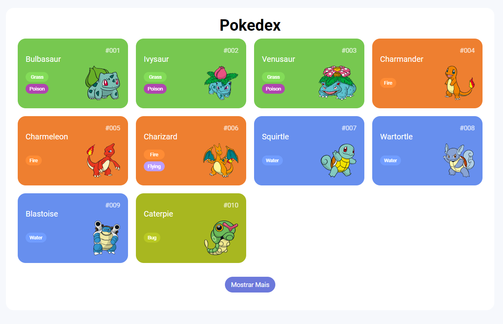
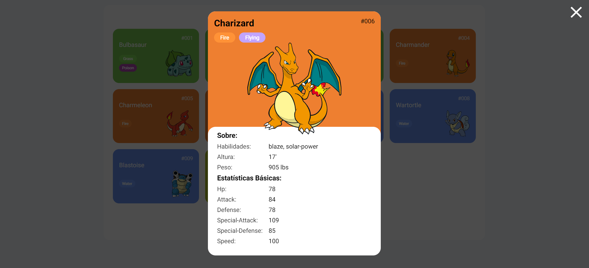
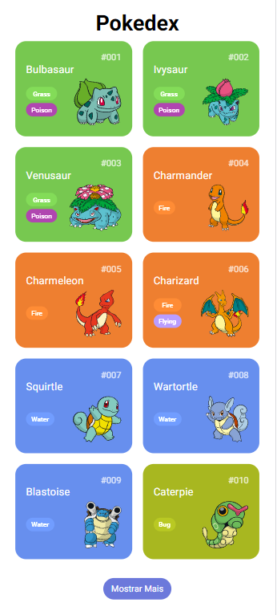
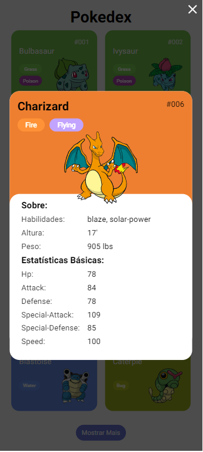

# Pokedex
Venha explorar o mundo Pokémon com essa incrível pokedex, feita com html, css e javasript. Essa pokedex consome os dados da <a href="https://pokeapi.co/docs/v2">pokeApi</a>, uma API REST gratuita e atualizada com os mais novos pokémons e seus detalhes.

## Versão para desktop:

Visão no computador.

Ao clicar no card irá aparecer os detalhes pokémon. 

## Versão para mobile:

Visão no celular.

Ao clicar no card irá aparecer os detalhes pokémon.